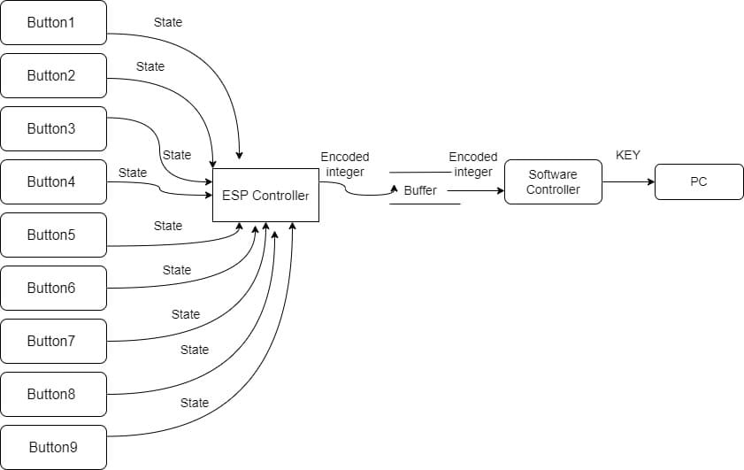

# Keyboard for the Visually Impaired

---

<!--
This is a sample image, to show how to add images to your page. To learn more options, please refer [this](https://projects.ce.pdn.ac.lk/docs/faq/how-to-add-an-image/)

 -->

## Team

- E/19/003, Abeysinghe A.M.H.P., [email](e19003@eng.pdn.ac.lk)
- E/19/004, Abeysinghe R.B., [email](e19004@eng.pdn.ac.lk)
- E/19/236, Manikdiwela W.L., [email](e19236@eng.pdn.ac.lk)
- E/19/443, Wijayawardana K.G.D.T., [email](e19443@eng.pdn.ac.lk)

## Table of Contents

1. [Introduction](#introduction)
2. [Control & Data Flow](#control-&-data-flow)
3. [User Experince](#user-experince)
4. [Links](#links)

---

## Introduction

Welcome to our revolutionary project aimed at creating an innovative keyboard solution catered specifically to the needs of the visually impaired. This keyboard generates characters with correct key combinations, accompanied by auditory cues that announce the typed character, providing an empowering typing experience.

## Control & Data Flow

### Data Flow

  
### Control Flow

### Giving Inputs

> The system is equipped with a set of 9 pushbuttons, each with a distinct role in character input. Of these buttons, 6 are dedicated to forming character combinations, while the remaining 3 serve as essential controls for backspacing, inserting spaces, and mode selection. The primary mode of connection for this system is through a USB interface, ensuring seamless data exchange and reliable communication between the ESP32 microcontroller and a connected PC.

> In addition to the USB connection, the system offers additional features, expanding its capabilities to include wireless communication options. Users can opt for wireless data transfer via both Wi-Fi and Bluetooth connections, enhancing the versatility and efficiency of text input and data exchange between the ESP32 device and the connected PC. These wireless connections provide convenience and flexibility, making the system suitable for a wide range of applications.

  

### Getting Outputs

> Serial output from the system is managed through Python scripts. The key libraries employed in this process include pyserial, which facilitates communication with the hardware, and pynput, enabling seamless integration of keyboard and mouse inputs. asyncio enhances asynchronous operations, ensuring smooth and efficient execution. Additionally, voice feedback is provided using pyttsx3, enhancing user interaction by adding vocal responses to system actions. These Python libraries collectively empower the system to offer comprehensive control, user-friendly input, and informative voice output for an enriched user experience.

 

## Design Concept

   
 
## User Experince

- The system offers extensive character support, encompassing over 50 characters, including virtually all keys commonly found on a standard keyboard. This comprehensive range includes numbers and letters, both uppercase and lowercase, adhering to the standard Braille alphabet pattern for intuitive input. For special characters, users can simply type the character's name, aided by an efficient auto-searching and auto-filling system that condenses the process to a maximum of three letters, ensuring swift and accurate access to these additional characters.
- The system simplifies user interaction by adhering to standard Braille alphabet patterns, minimizing the need for complex memorization. It offers voice responses that provide real-time feedback to users as they press keys, enhancing the user experience and ensuring accuracy. Notably, after each word is input, the system offers a vocalized response of the complete word, allowing users to verify their input and reinforcing effective communication.

## Project Design

   

## Links

- [Project Repository](https://github.com/cepdnaclk/e19-co227-Keyboard-for-Visually-Impaired)
- [Project Page](https://cepdnaclk.github.io/e19-co227-Keyboard-for-Visually-Impaired)
- [Department of Computer Engineering](http://www.ce.pdn.ac.lk/)
- [University of Peradeniya](https://eng.pdn.ac.lk/)

[//]: # "Please refer this to learn more about Markdown syntax"
[//]: # "https://github.com/adam-p/markdown-here/wiki/Markdown-Cheatsheet"
